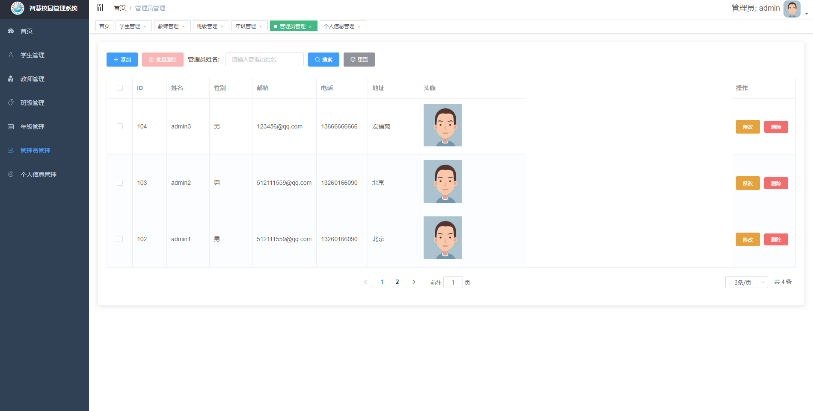

# zhxy
智慧校园云端管理系统的设计和实现

#### 项目介绍

#### 技术架构

前端

| 技术   | 说明           |
| ------ | -------------- |
| HTML   | 超文本标记语言 |
| Vue.js | 前端框架       |
| Axios  | Ajax请求工具   |

后端

| 技术         | 说明                |
| ------------ | ------------------- |
| Java         | 面向对象高级语言    |
| SpringBoot   | 微服务开发框架      |
| Mybatis Plus | 持久层框架          |
| Swagger2     | API接口文档生成工具 |
| MySQL        | 关系型数据库        |

开发环境

| 说明       | 工具    |
| ---------- | ------- |
| 研发工具   | IDEA    |
| 服务器     | Tomcat  |
| 项目构建   | Maven   |
| 数据库工具 | Navicat |

#### 项目结构

功能介绍——

​				项目角色

​				首页展示

​				学生管理

​				教师管理

​				班级管理

​				年级管理

​				管理员管理

​				个人信息管理

#### 项目演示

